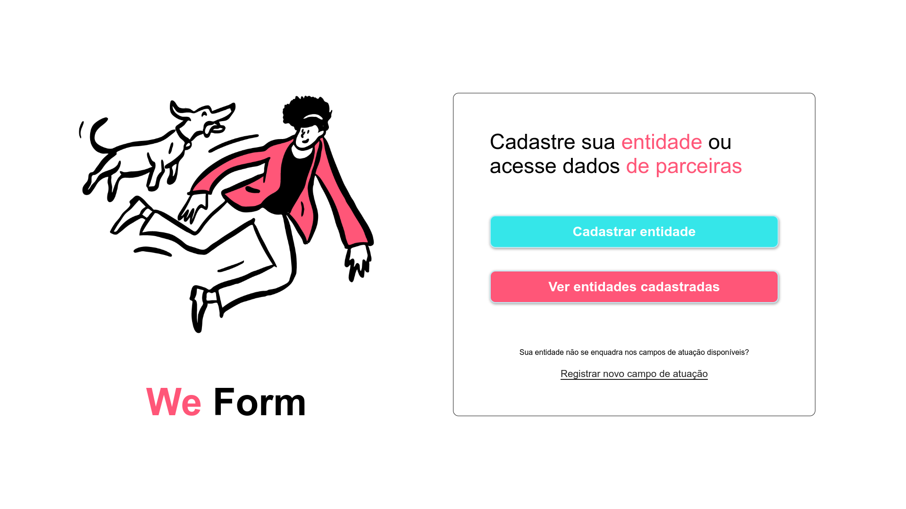

# 📄 We Form - Sistema de Cadastro de Entidades
**We Form** é uma plataforma online onde é possível registrar entidades e acessar dados de entidades cadastradas em diversas áreas de atuação.

---

<p style="text-align: center">📍 Projeto base desenvolvido durante a Trilha Digital / Web Front-End, curso ministrado pela <strong>Ada Tech</strong> e promovido por meio do Santander Coders</p>

## 🖼️ Demonstração


Confira o projeto ao vivo: [ inserir link ]


## 🚀 Funcionalidades
* Cadastro de entidades 🏢
* Visualização de entidades cadastradas 🔍
* Cadastro de novos campos de atuação 🔧
* Cadastro de pontos de coleta 🗑️


## 💡 Como Usar
1. ### Registro de Entidade:
   Clique no botão "Cadastrar entidade" para iniciar o processo de cadastro de uma nova entidade. Preencha as informações solicitadas e clique em Cadastrar.

2. ### Ver Entidades Cadastradas:
   Para visualizar as entidades já cadastradas, clique no botão "Ver entidades cadastradas".

3. ### Registrar Novo Campo de Atuação:
   Se o campo de atuação da sua entidade não estiver disponível, você pode registrar um novo campo de atuação clicando no link "Registrar novo campo de atuação".

4. ### Adicionar Pontos de Coleta:
   Ao cadastrar sua entidade, você pode adicionar pontos de coleta. Basta preencher o número de pontos e clicar no ícone de adição.

---

## 🛠️ Tecnologias Utilizadas
* HTML5
* CSS3
* JavaScript
* Figma
* Boxicons
* Google Fonts


## 🌟 Melhorias Futuras
* Implementar persistência de dados.
* Ajustar funcionalidade e validações do formulário.
* Adaptar layout para mobile, tablet e desktop.
* Adicionar dark mode.

---


## 📖 Como Executar o Projeto
### Pré-requisitos:
- Um navegador moderno (Google Chrome, Firefox, Edge).
- [Git](https://git-scm.com/) para clonar o repositório (opcional).

### Passos:
1. Clone o repositório:
   ```bash
   git clone https://github.com/vitoriabarbosa/we-form.git

2. Navegue até o diretório do projeto:
   ```bash
   cd we-form

3. Abra o arquivo index.html no navegador:
- Em um editor, clique com o botão direito no arquivo e escolha Abrir no Navegador.
- Ou use extensões como Live Server no VS Code.<br><br>


## 📝 Licença
Este projeto está sob a licença MIT. Para mais informações, veja o arquivo [LICENSE](LICENSE).
